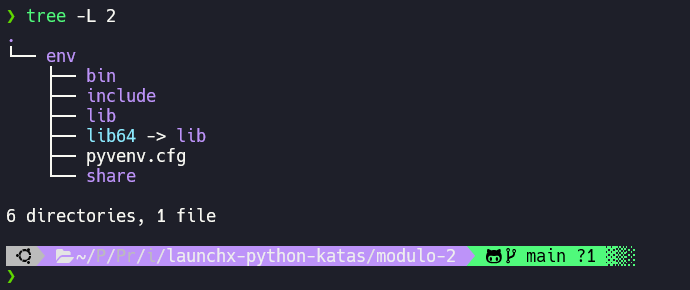
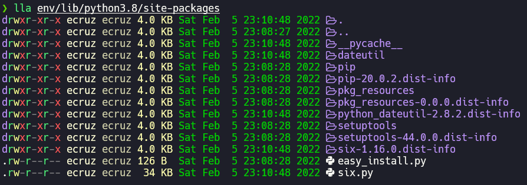
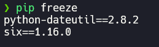

# Ejercicio - Crear un paquete

En este ejercicio, aprenderás a utilizar entornos virtuales como una forma para no afectar a los paquetes instalados globalmente u otros programas que se ejecutan en tu máquina.

*Para este ejercicio es necesario que lo ejecutes desde la terminal, línea de comandos, cmd, consola, cli, etc. de tu computadora, sé que es desafíante, pero no te preocupes ¡¡Sé que puedes lograrlo!!*

## Crear un entorno virtual

Crea un entorno virtual mediante ``venv``

* Ejecutar en su terminal: ``python3 -m venv env``

    ```
       python3 -m venv env 
    ```
    Ahora tienes un directorio (folder) ``env`` creado en tu terminal.

* Ejecuta el comando para activar el entorno virtual: ``source env/bin/activate``

    ```
    source env/bin/activate
    # Windows
    env\bin\activate

    # Linux, WSL or macOS
    source env/bin/activate
    ```

Ahora ves en tu terminal ``(env)``. Eso significa que has activado tu entorno virtual y se ha aislado del resto de tu máquina.

### Solucion
Cree el entorno virtual y mi arbol de directorios se ve de la siguiente forma. 



> Al activar mi entorno se muestra la leyenda `modulo-2` en lugar de `env` pero esto es debido a la configuracion de mi terminal.


## Instalar una biblioteca

Ahora que estás dentro de tu entorno virtual, puedes instalar una biblioteca y saber que la biblioteca solo existirá en el entorno virtual.

* Ejecuta el comando ``pip freeze`` para ver las bibliotecas instaladas en tu entorno:

    ```
    pip freeze
    ```

    No deberías obtener respuesta. A continuación, veamos cómo cambia la salida de ``pip freeze`` cuando se agrega una biblioteca (un paquete).

* Ejecuta el comando ``pip install`` para instalar una biblioteca:
   ```
   pip install python-dateutil
   ```
* Un gran mensaje de salida de texto dice que está instalando tu biblioteca, y debe terminar con la siguiente oración:

    ```
    Successfully installed python-dateutil-2.8.2 six-1.16.0
    ```
* Vuelve a ejecutar ```pip freeze``` para ver cómo ha cambiado tu lista de bibliotecas:
    ```
    pip freeze
    ```
* Ahora deberías ver la siguiente lista:
    ```
    python-dateutil==2.8.2
    six==1.16.0
    ```

### Solucion
Realice la instalacion de la biblioteca `dateutil` y verifique su instalacion con `pip freeze` dentro de mi entorno virtual activado.

En esta imagen se muestran otros directorios que se crearon a partir de la creacion del entorno ademas del paquete recien instalado.



En esta otra imagen se muestra el resultado de ejecutar `pip freeze`



### Desactivar un entorno virtual

Hasta ahora, has creado un entorno virtual y le has agregado un paquete. Sin embargo, es posible que estés trabajando en varios proyectos de Python y necesites cambiar entre ellos. Para hacer eso, debes salir (desactivar) tu entorno virtual.

Ejecuta el comando ``deactivate``:
```
deactivate
```

Observa cómo cambia el mensaje de tu terminal ``(env)`` a cómo se veía antes.

¡Felicidades! Has logrado crear y usar correctamente un entorno virtual.

### Observaciones
Para subir mi programa a un repositorio de github encontre que no se debe subir el directorio del entorno virtual si no que se debe crear un archivo que puede ser un archivo de texto llamado `requirements.txt`

Este archivo se debe contener los datos de los paquetes que requiere nuestro programa. Podemos incluir los datos de dos formas:

1. Editando el archivo requirements.txt y pegando el output que nos arroja `pip freeze` 
2. Desde la terminal podemos crear el archivo y añadir los datos en el ejecutando `pip freeze > requirements.txt`

Una vez que tenemos nuestro programa y el archivo requirements podemos subir nuestro repositorio a github no sin antes agregar en el archivo `.gitignore` la carpeta `env` para que se omita.

Finalmente cuando clonamos ese repositorio en otro equipo y creemos otro entorno virtual y lo activemos solo debemos ejecutar el comando `pip install -r requirements.txt -v` para que se instalen los paquetes que requiere nuestro programa. 
- La flag `-r` es de requirement y es para indicar que se instalara un paquete desde un archivo
- La flag `-v` es de verbose y sirve para que se muestren en pantalla los detalles de la ejecucion.

---


Curso Propedútico de Python para Launch X - Innovacción Virtual.

Material desarrollado con base en los contenidos de MSLearn y la metáfora de LaunchX, traducción e implementación por: Fernanda Ochoa - Learning Producer de LaunchX.

Redes:
* GitHub: [FernandaOchoa](https://github.com/FernandaOchoa)
* Twitter: [@imonsh](https://twitter.com/imonsh)
* Instagram: [fherz8a](https://www.instagram.com/fherz8a/)